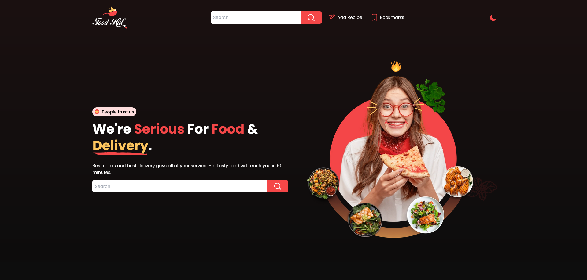

# Food Hut

Nuxt 3 & Tailwind 3 version of Forkify App from Jonas Schmedtmann's JavaScript Course.

### 🔗 Links

- [Live Site](https://foodhut.vercel.app/)
- [Source Repo](https://github.com/MuhammadM1998/Food-Hut)

### ‍💻 Stack

Feedback is always appreciated 📝🙏
